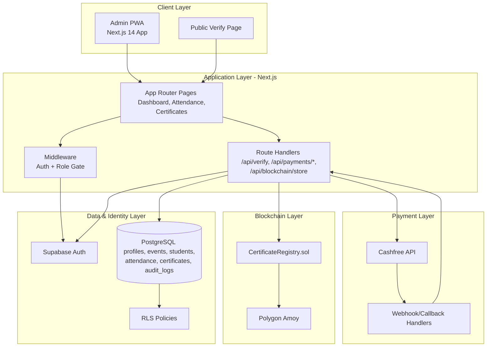

# System Architecture Diagram

## Main Data Flows

1. **Authentication & Access Control**
   - Users sign in through Supabase Auth.
   - Next.js middleware and server-side checks enforce role-based access and RLS-backed data authorization.

2. **Event to Certificate Lifecycle**
   - Event manager creates events.
   - Faculty/admin authorizes and manages attendance.
   - Certificate issuance computes hashes and stores records in PostgreSQL.

3. **On-chain Anchoring & Verification**
   - Server route handlers submit certificate hashes to the `CertificateRegistry` contract on Polygon.
   - Public verification checks certificate details against DB + on-chain hash proofs.

4. **Payments Integration**
   - Order creation and status updates go through Cashfree APIs.
   - Webhooks/callbacks update payment state in the app.
